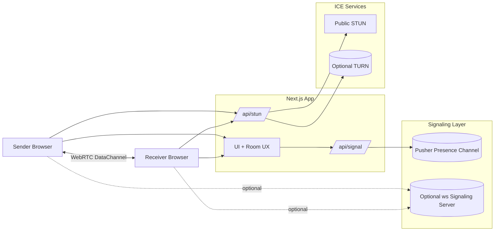

# CroxShare

## System design diagram



## Overview

CroxShare is a LAN-first peer-to-peer file sharing app. It uses WebRTC DataChannels for direct browser-to-browser transfers and uses WebSockets for signaling. Files move device-to-device with no file relay server.

## What it does

- Short room codes for quick pairing
- Direct WebRTC DataChannel transfer (ordered, binary)
- Progress, speed, and ETA with auto-download on completion
- TURN fallback via `/api/stun` for harder NAT cases

## How it works

1. Sender creates a room and shares the code.
2. Peers exchange SDP + ICE over WebSockets (Pusher or optional `ws`).
3. A WebRTC peer connection opens a DataChannel.
4. Files are chunked and sent with backpressure handling.
5. Receiver reassembles chunks and downloads.

## Tech stack

- WebRTC DataChannels, WebSockets (Pusher presence by default)
- Next.js 15 + React 19 + TypeScript + Tailwind CSS

## Quick start

```bash
npm install
npm run dev
```

Open `http://localhost:3000` or `http://<LAN_IP>:3000`.

## Environment

- `PUSHER_APP_ID`, `PUSHER_SECRET`, `NEXT_PUBLIC_PUSHER_KEY`, `NEXT_PUBLIC_PUSHER_CLUSTER`
- `TURN_URLS`, `TURN_USERNAME`, `TURN_CREDENTIAL` (optional)

## Deployment

This app runs a custom Node server (`server.js`) with a `ws` WebSocket signaling
server attached, so it needs a host that supports persistent, long-running
processes — not a stateless serverless platform like Vercel.

Deploy on [Render](https://render.com) as a **Web Service**:

1. Push this repo to GitHub/GitLab.
2. In the Render dashboard, choose New → Web Service and connect the repo
   (or run `render.yaml` as a Blueprint for infra-as-code setup).
3. Build command: `npm install && npm run build`
4. Start command: `npm start`
5. Set the environment variables listed above in the Render dashboard —
   in particular `NEXT_PUBLIC_APP_URL` should be your `onrender.com` URL
   (or custom domain).

Render's free tier spins the service down after 15 minutes of inactivity
(cold starts take 30–60s on the next request, and idle WebSocket connections
are subject to the same timeout). Use a paid instance type for always-on
availability.

### Health check

`server.js` exposes a lightweight `GET /healthz` endpoint that returns `200 ok`
without rendering a page. `render.yaml` points Render's health probe at it via
`healthCheckPath: /healthz`, so deploys are only marked live once the app
actually responds.

### Keep the free instance warm (optional)

To avoid cold starts on the free tier, `.github/workflows/keep-warm.yml` pings
`/healthz` every ~10 minutes (just under Render's 15-minute idle window) using a
scheduled GitHub Actions workflow. To enable it:

1. In your GitHub repo, go to **Settings → Secrets and variables → Actions**.
2. Add a repository secret named `RENDER_APP_URL` set to your service URL
   (e.g. `https://croxshare.onrender.com`).
3. The workflow then runs on schedule automatically. You can also trigger it
   manually from the **Actions** tab (workflow_dispatch).

Caveats:

- **Free-tier hours**: Render's free web services share a monthly instance-hour
  allowance (~750 hrs). Keeping one service warm 24/7 uses ~730 hrs — it fits,
  but leaves little headroom if you run other free services.
- **Schedule drift**: GitHub may delay scheduled runs during peak load, which is
  why the interval is set well below 15 minutes.
- **Inactivity pause**: GitHub disables scheduled workflows after 60 days without
  repo activity. Push a commit (or re-enable the workflow) to resume.
- **Alternatives**: external uptime pingers like UptimeRobot or cron-job.org work
  just as well if you prefer not to use GitHub Actions.


## Resume-aligned highlights

- WebRTC-based P2P file sharing with Node.js signaling and WebSockets.
- Chunked file transport with backpressure for smooth large transfers.
