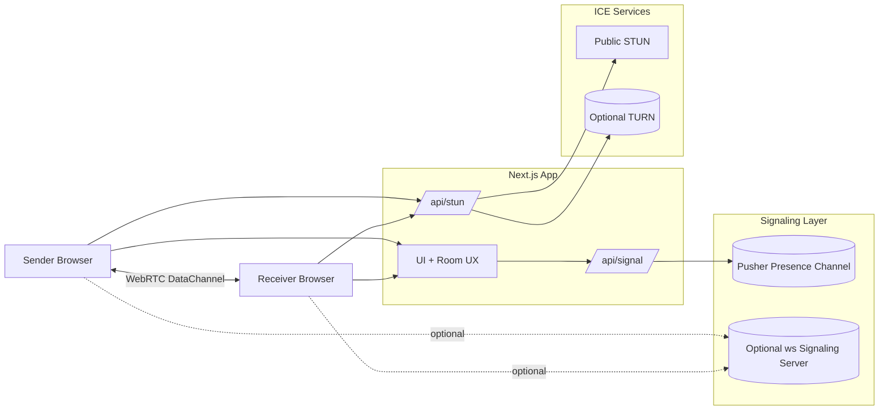

# CroxShare

## System design diagram



## Overview

CroxShare is a LAN-first peer-to-peer file sharing app. It uses WebRTC DataChannels for direct browser-to-browser transfers and uses WebSockets for signaling. Files move device-to-device with no file relay server.

## What it does

- Short room codes for quick pairing
- Direct WebRTC DataChannel transfer (ordered, binary)
- Progress, speed, and ETA with auto-download on completion
- TURN fallback via `/api/stun` for harder NAT cases

## How it works

1. Sender creates a room and shares the code.
2. Peers exchange SDP + ICE over WebSockets (Pusher or optional `ws`).
3. A WebRTC peer connection opens a DataChannel.
4. Files are chunked and sent with backpressure handling.
5. Receiver reassembles chunks and downloads.

## Tech stack

- WebRTC DataChannels, WebSockets (Pusher presence by default)
- Next.js 15 + React 19 + TypeScript + Tailwind CSS

## Quick start

```bash
npm install
npm run dev
```

Open `http://localhost:3000` or `http://<LAN_IP>:3000`.

## Environment

- `PUSHER_APP_ID`, `PUSHER_SECRET`, `NEXT_PUBLIC_PUSHER_KEY`, `NEXT_PUBLIC_PUSHER_CLUSTER`
- `TURN_URLS`, `TURN_USERNAME`, `TURN_CREDENTIAL` (optional)

## Resume-aligned highlights

- WebRTC-based P2P file sharing with Node.js signaling and WebSockets.
- Chunked file transport with backpressure for smooth large transfers.
